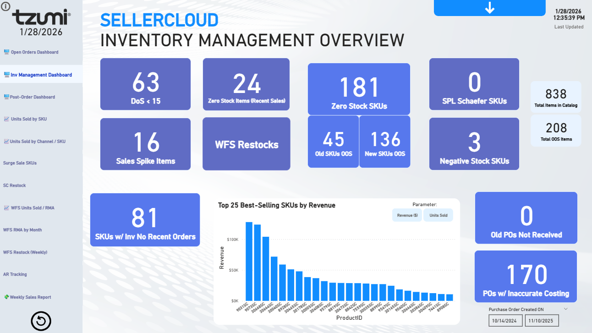
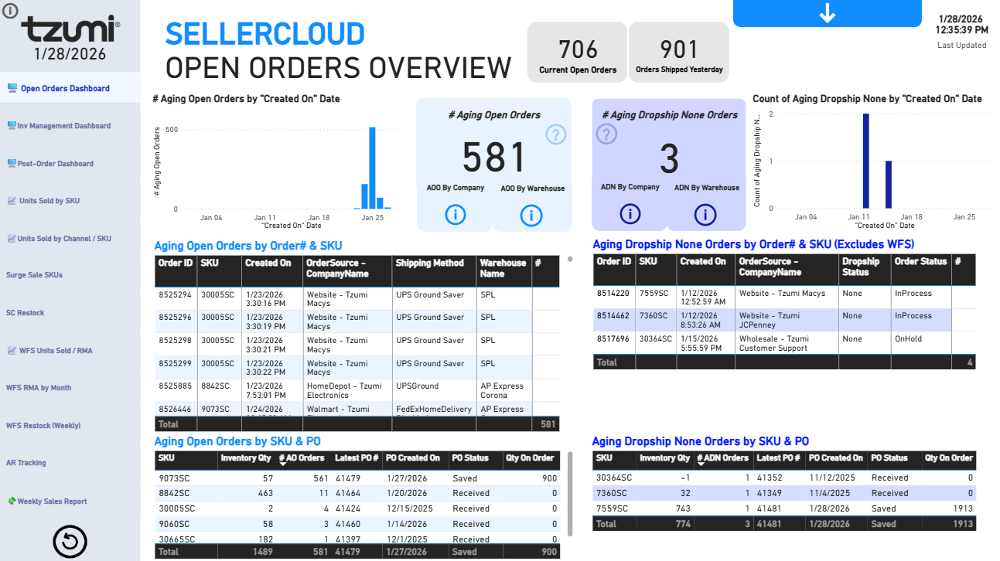
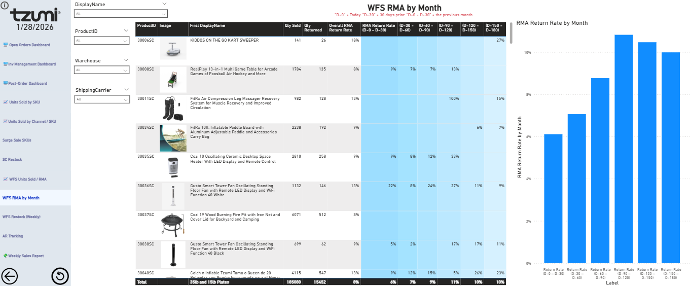
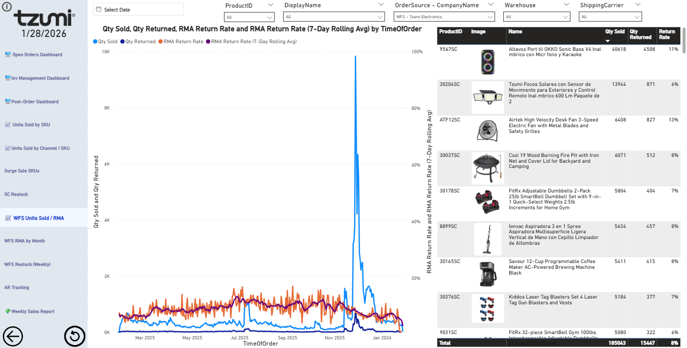
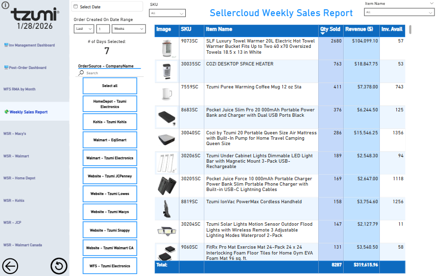

# Sellercloud E-Commerce Operations & Inventory Suite

## 📊 Executive Overview
This Power BI suite provides end-to-end visibility into the Sellercloud ecosystem, integrating **Inventory Management**, **Order Fulfillment**, and **Post-Order Analytics**. It is designed to bridge the gap between warehouse operations and executive decision-making.

## 🚀 Key Dashboard Modules

### 1. Inventory Management Overview

* **Health Metrics:** Real-time tracking of Days of Stock (DoS < 15), Zero-Stock SKUs, and Negative Stock alerts.
* **Revenue Drivers:** Identification of Top 25 Best-Selling SKUs by Revenue vs. Units Sold.
* **Warehouse Efficiency:** Visibility into SPL Schaefer SKUs and WFS Restock requirements.

### 2. Open Orders & Fulfillment

* **Aging Analysis:** Tracking aging open orders with breakdown by "Created On" date and warehouse location.
* **Stock-to-Order Ratio:** Detailed table comparing Inventory Qty against Open Orders and latest Purchase Orders (PO).
* **Dropship Monitoring:** Dedicated tracking for Aging Dropship None orders (Excludes WFS).

### 3. Post-Order & RMA Analytics

* **Carrier Performance:** Monitoring "No Carrier Scan" packages across FedEx and UPS to identify transit bottlenecks.
* **Returns Management (RMA):** * Monthly RMA return rate trends and granular return analysis by Product ID.
    * 7-day rolling average of return rates vs. quantity sold to spot quality control issues.
    

### 4. Sales & Velocity Insights

* **Weekly Sales Report:** Dynamic reporting on top SKUs showing revenue, quantity sold, and inventory availability.
* **Surge Sales Detection:** Advanced logic identifying SKUs with sales spikes (e.g., 2x+ above 7-day MAX) to prevent stockouts.

## 🛠️ Technical Architecture
* **Data Source:** Sellercloud API / SQL Backend.
* **Version Control:** Developed using the **Power BI Project (.pbip)** format for granular Git tracking.
* **DAX Highlights:**
    * 7-Day Rolling Averages for RMA rates.
    * Custom "Surge Multiplier" logic for inventory alerts.
    * Complex aging buckets for open order fulfillment.

---

## 📖 How to Use
1. **Clone the Repo:** `git clone https://github.com/thejessluo/E-Commerce-Order-Inventory-Report.git`
2. **Open Project:** Open the `.pbip` file in Power BI Desktop (December 2023 release or later).
3. **Data Refresh:** Access to underlying Sellercloud data sources is required to refresh the semantic model.
